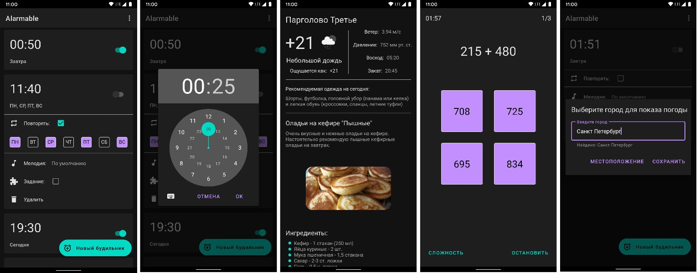

# Alarmable - будильник

[Alarmable release.apk](app/release/app-release.apk)

#### Будильник, для отключения которого потребуется решить несколько примеров, после чего на экране блокировки откроется экран с текущей погодой и рецептами на завтрак.
### Скриншоты

## Технологии
- MVVM, Kotlin StateFlow
- Retrofit, OkHttp, Location services
- Room, DataStore
- AlarmManager, BroadcastReceiver, Foreground service
- Material design, ViewBinding
- DI - Koin